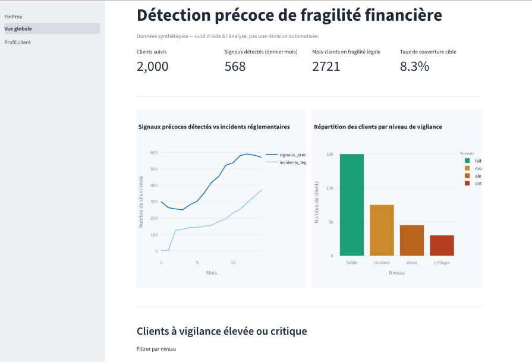

Bon exemple à suivre — la structure est claire, orientée résultats concrets, et le ton "j'ai résolu un vrai problème métier" plutôt que "voici ma stack technique" est exactement ce qui distingue un projet portfolio efficace. On adapte cette structure à notre sujet, avec nos vrais chiffres.

**Pour les images** : je ne peux pas extraire tes captures d'écran directement dans le repo — sauvegarde tes 2 meilleures captures (vue globale + profil client) dans un nouveau dossier `docs/assets/`, nommées `dashboard_vue_globale.png` et `dashboard_profil_client.png`. Je référence ces chemins dans le README ci-dessous.

Voici le contenu complet à mettre dans `README.md` (remplace tout) :

```markdown
# FinPrev — Détection précoce de fragilité financière


Un client sur dix qui bascule dans une situation de fragilité financière l'était déjà, en silence, plusieurs mois avant que la loi n'oblige la banque à réagir.

Ce projet construit un signal qui détecte cette dégradation **avant** le seuil réglementaire — pas un modèle de scoring de crédit, pas une prédiction de pauvreté, un outil d'aide à l'analyse pour agir de façon préventive plutôt que réactive.

## Sommaire

- [Contexte](#contexte)
- [Le problème](#le-problème)
- [Les données](#les-données)
- [Démonstration interactive](#démonstration-interactive)
- [Résultats](#résultats)
- [Architecture et phases du projet](#architecture-et-phases-du-projet)
- [Stack technique](#stack-technique)
- [Structure du repo](#structure-du-repo)
- [Documentation clé](#documentation-clé)
- [Faire tourner le projet](#faire-tourner-le-projet)
- [Limites connues et prochaines étapes](#limites-connues-et-prochaines-étapes)

## Contexte

Depuis la loi de 2013, les banques françaises ont l'obligation légale de détecter leurs clients en situation de fragilité financière et de leur proposer une offre spécifique plafonnée. Les critères réglementaires (incidents répétés, inscription au Fichier Central des Chèques, dossier de surendettement) détectent cette fragilité **une fois qu'elle est déjà installée**.

## Le problème

> Peut-on détecter, à partir du seul comportement transactionnel, les clients qui basculeront dans les critères réglementaires de fragilité dans les 3 prochains mois — avant qu'ils ne les atteignent — pour permettre une action préventive plutôt que réactive ?

**Énoncé SMART** : construire un modèle capable de repérer au moins 90 % des clients qui basculeront réellement en fragilité légale dans les 3 mois (recall), avec un score explicable pour chaque client, afin qu'un conseiller puisse agir en amont plutôt qu'après le franchissement du seuil légal.

## Les données

Ce projet utilise exclusivement des **données synthétiques**, générées pour simuler des trajectoires réalistes de 2000 clients sur 18 mois (profils stable / dégradation progressive / fragile dès le départ), avec injection contrôlée de patterns de dégradation, plafond de découvert, et bruit réaliste. Aucune donnée bancaire réelle n'est utilisée — voir [docs/01_data_dictionary.md](docs/01_data_dictionary.md) pour le détail complet.

## Démonstration interactive

Dashboard Streamlit à 2 pages : vue de portefeuille et profil client individuel avec explicabilité SHAP.

**Lien** : *(à venir après déploiement — Streamlit Community Cloud)*




## Résultats

Trois approches comparées objectivement, avec validation temporelle stricte (train sur les mois 0-11, test sur les mois 12-14 — jamais de split aléatoire) :

| Modèle | Recall | Précision | F1 |
|---|---|---|---|
| Baseline par règles métier | 0.949 | 0.263 | 0.412 |
| Régression logistique | 0.862 | 0.331 | 0.478 |
| **XGBoost (retenu)** | **0.956** | **0.386** | **0.55** |

**Signal le plus déterminant** (SHAP) : la fréquence de découverts sur les 3 derniers mois, suivie de la fréquence d'incidents de paiement et du ratio charges/revenus — le modèle s'appuie principalement sur le comportement récent du client, pas sur son profil socio-professionnel.

Chaque score individuel est explicable (waterfall SHAP), directement affiché dans le dashboard pour justifier une alerte auprès d'un conseiller.

## Architecture et phases du projet

| Phase | Contenu | Statut |
|---|---|---|
| 1 | Cadrage métier et définition de la cible | Terminé |
| 2 | Génération de données synthétiques (2000 clients, 18 mois) | Terminé |
| 3 | Exploration (EDA) — signal validé empiriquement avant tout modèle | Terminé |
| 4 | Infrastructure GCP (GCS, BigQuery, service account) | Terminé |
| 5 | Transformation SQL (dbt — staging / intermediate / marts) | Terminé |
| 6 | Modélisation (baseline → régression logistique → XGBoost → SHAP) | Terminé |
| 7 | Dashboard Streamlit (vue portefeuille + profil client) | Terminé |
| 8 | Orchestration (Airflow via Docker Compose) | Terminé |
| 9 | Intégration continue (GitHub Actions) | Terminé |

Flux de données complet :

```
Génération synthétique (Python)
        ↓
GCS (landing zone)
        ↓
BigQuery (raw)
        ↓
dbt (staging → intermediate → marts)
        ↓
Modèle XGBoost + SHAP
        ↓
Scores écrits dans BigQuery
        ↓
Dashboard Streamlit
```

Orchestré de bout en bout par un DAG Airflow, exécuté dans Docker Compose en local.

## Stack technique

Python · Google Cloud Storage · BigQuery · dbt-core (adapter BigQuery) · Apache Airflow (Docker Compose) · scikit-learn · XGBoost · SHAP · Streamlit · GitHub Actions

## Structure du repo

```
data_generation/    -> génération des données synthétiques
dbt_project/        -> transformation SQL (staging/intermediate/marts)
dags/               -> DAG Airflow
infra/               -> Dockerfiles, docker-compose, setup GCP
ml/                  -> scoring du modèle entraîné
dashboard/           -> application Streamlit (2 pages)
notebooks/           -> exploration et entraînement (jamais en production)
docs/                -> documentation métier, architecture, éthique
tests/               -> tests unitaires (génération de données)
.github/workflows/   -> intégration continue
```

## Documentation clé

- [Contexte métier et définition de la cible](docs/00_business_context.md)
- [Dictionnaire de données](docs/01_data_dictionary.md)
- [Architecture technique](docs/02_architecture.md)
- [Méthodologie de modélisation](docs/03_methodology.md)
- [Model card](docs/04_model_card.md)
- [Éthique et limites](docs/05_ethics_and_limits.md)
- [Spécification du dashboard](docs/06_dashboard.md)
- [Notes d'exploration (EDA)](docs/07_data_exploration_notes.md)
- [Mise en place GCP](docs/08_gcp_setup_notes.md)

## Faire tourner le projet

```bash
# Environnement
python -m venv .venv
pip install -r requirements.txt

# Génération des données synthétiques
python -m data_generation.run_generation

# Infrastructure GCP (bucket, dataset, service account)
# voir docs/08_gcp_setup_notes.md pour le détail complet

# Pipeline dbt
cd dbt_project && dbt build

# Scoring du modèle
python ml/score_clients.py

# Dashboard
streamlit run dashboard/app.py

# Orchestration complète (Airflow)
cd infra && docker compose -p finprev up -d
# UI Airflow sur http://localhost:8081
```

## Limites connues et prochaines étapes

- **Données 100 % synthétiques** — les résultats ne se transposent pas directement à des données bancaires réelles
- **`age` ressort avec un poids notable dans SHAP**, possiblement lié à la corrélation âge/statut construite dans le générateur plutôt qu'à un vrai signal comportemental — voir [docs/04_model_card.md](docs/04_model_card.md)
- **Déséquilibre train/test documenté** (6.2 % à 11.7 % de taux positif selon la période), lié à la distribution du mois de bascule dans le générateur — voir [docs/07_data_exploration_notes.md](docs/07_data_exploration_notes.md)
- **Un seul environnement** (pas de séparation dev/prod), authentification via clé de service account locale plutôt qu'un système de secrets managés — limite assumée pour un projet portfolio
- **Prochaine priorité** : déploiement public du dashboard, puis exploration d'un réentraînement périodique orchestré par le DAG existant
```